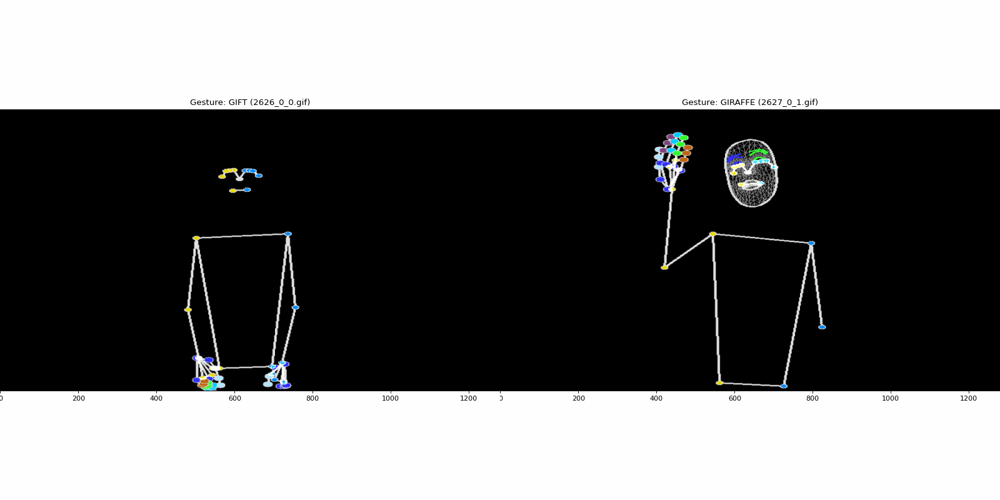
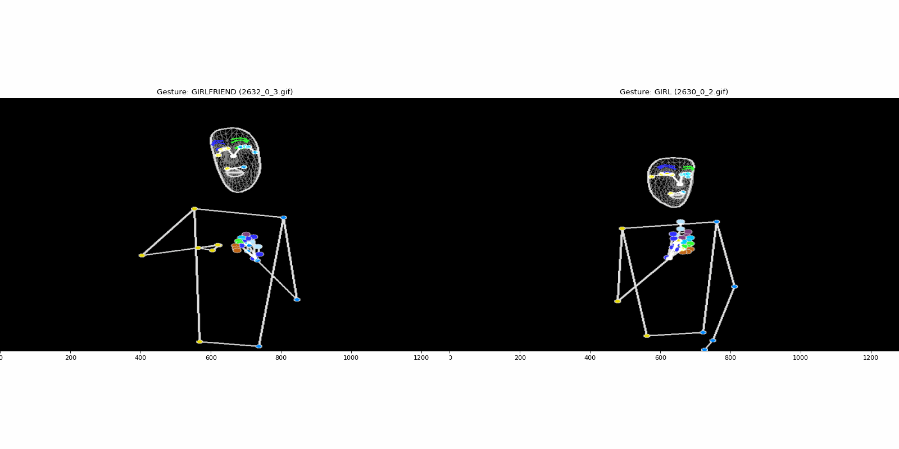
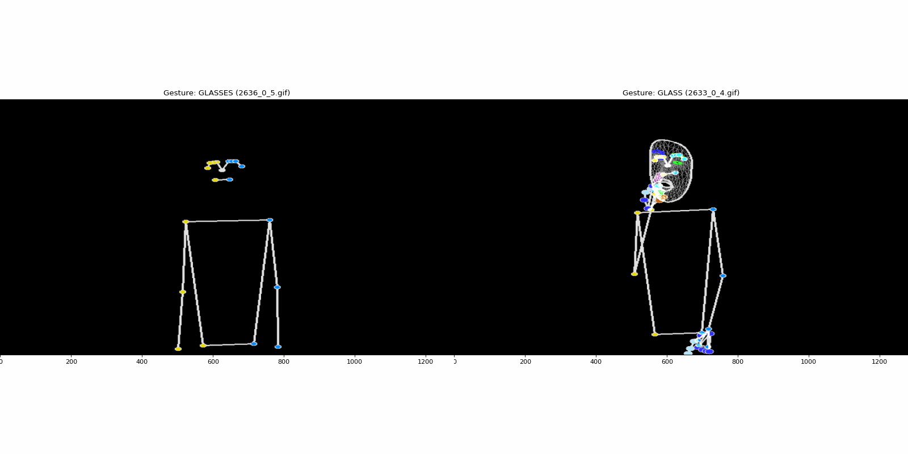

# PerennityAI MediaPipe Data Visualizer
```perennityai-mediapipe-data-viz``` is a tool to visualize hand, face, and pose landmarks from MediaPipe data with animations and overlay capabilities. It helps developers and researchers easily view MediaPipe data in a dynamic, combined format for visual analysis and debugging.

## Features
- Animation Creation: Generate animations from landmark data for face, hand, and pose.
- Visualization of Individual Components: Separate visualizations for hands, face, and body pose landmarks.
- Combined Image Output: Overlays landmarks for all components in a single image.
- Support for Multiple File Formats: Compatible with .csv and .tfrecord file formats.
- Automated Data Processing: Filters and cleans data for efficient visualization.

## Configuration Requirements
This tool assumes that you have already generated or extracted landmark points with the correct headers specified in the configuration file configs/config.ini. If these landmarks are not yet available, please use ```perennityai-mp-gen``` to extract and save landmark data before running this tool.


## Demo

Here are some demonstrations of the features and functionalities of the project:

### Feature 1: User Interaction


### Feature 2: Data Visualization


### Feature 3: Exporting Data



## Installation
```bash
pip install perennityai-mediapipe-data-viz
from perennityai-mediapipe-data-viz import DataVisualizer
```

```or```

Clone the repository and install required packages:

```bash
git clone https://github.com/your-username/perennityai-mediapipe-data-viz.git
cd perennityai-mediapipe-data-viz
pip install -r requirements.txt
```

## Usage
You can run the visualization tool directly from the command line. Use the following syntax:

```bash
python data_visualizer.py --input_file <file_path> --output_dir <output_directory> 
```

## Command-Line Arguments
```bash
--input_file: Specifies the path to a single MediaPipe landmarks file, typically in .csv format (e.g., path/to/mp_landmarks_file/0.csv). 

--input_dir: Defines the directory path containing multiple MediaPipe landmarks files. 

--output_dir: The path where generated visualizations and processed files will be saved (e.g., path/to/output_directory).

--data_input_format: Specifies the input file format, typically "csv". This tells the tool what file type to expect in input_file or input_dir.

--verbose: Sets the logging level, which controls the amount of detail in console output. Use "INFO" for general information, "DEBUG" for detailed diagnostic information, or "ERROR" to show only critical errors.

--encoding: Defines the file encoding for reading CSV files (e.g., "ISO-8859-1"). 
```


```python

from perennityai-mediapipe-data-viz import DataVisualizer
# Usage Example: Load from a pretrained configuration file
try:
    # Example of config file data
    config = {
    "input_file": "path/to/mp_landmarks_file/0.csv",
    "input_dir": "path/to/mp_landmarks_file",
    "output_dir": "path/to/output_directory",
    "data_input_format": "csv",
    "verbose": "INFO",
    'encoding': 'ISO-8859-1' # CSV file encoding
    }


    # visualizer_from_pretrained = DataVisualizer.from_pretrained('path/to/config.json')
    visualizer_from_pretrained = DataVisualizer.from_pretrained(config)
    
    # Visualize the file, for example, with a CSV
    animation = visualizer_from_pretrained.visualize_data(
        tf_file_index=0  # index of CSV file in the input directory
    )

    # Process all samples and visualize .gif/mp4 file.
    for csv_file in glob.glob(os.path.join("path/to/mp_landmarks_file", '*.csv')):
        # Visualize the file, for example, with a CSV
        visualizer_from_pretrained.visualize_data(
            csv_file=csv_file
        )

except FileNotFoundError as e:
    print(f"Configuration loading failed: {e}")
```

## Key Classes and Methods

### DataVisualizer
Main class to handle data processing and visualization.
```
-- visualize_data: Visualizes data from a specified file by creating an animated view.
get_pose, get_face, get_hands: Methods to extract and visualize specific landmark types.

-- combine_images: Combines separate visualizations into a single, cohesive output.

-- create_animation: Generates an animation from landmark frames.
```

## License
This project is licensed under the MIT License. See the LICENSE file for details.